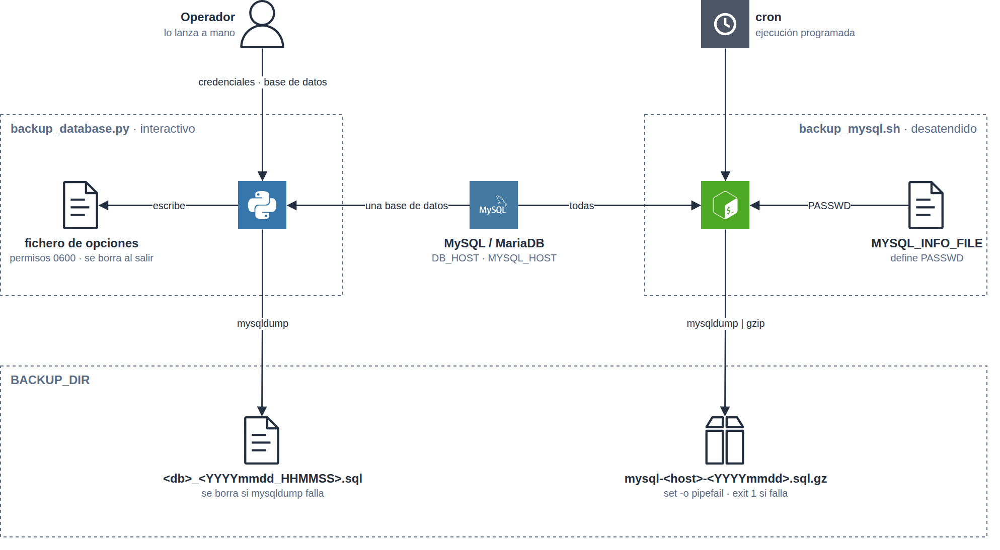
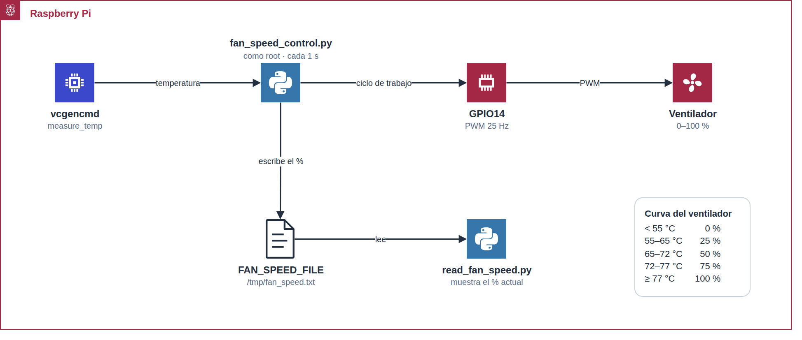
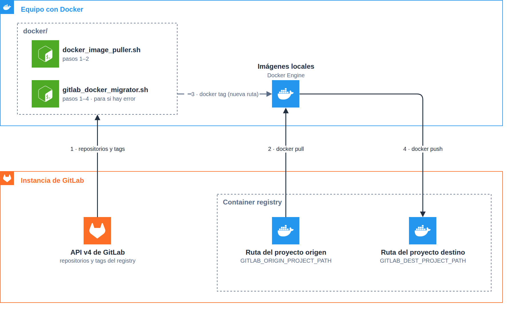

# sysadmin-toolkit

Colección de scripts de administración de sistemas, Raspberry Pi, Docker/GitLab
y procesado de vídeo, organizados por tarea.

## Estructura del repositorio

| Carpeta         | Contenido                                                                    |
| --------------- | ----------------------------------------------------------------------------- |
| `backup/`       | Copias de seguridad de bases de datos MySQL/MariaDB y utilidad SQL de motor. |
| `raspberry-pi/` | Temperatura y control de velocidad del ventilador en una Raspberry Pi.      |
| `system/`       | Alias, logrotate, UUID de discos y limpieza de directorios.                 |
| `docker/`       | Automatización de imágenes Docker contra el registro de GitLab.             |
| `media/`        | Análisis de calidad de archivos de vídeo.                                   |
| `docs/diagrams/` | Diagramas de los flujos principales, en draw.io y PNG.                     |

## Requisitos generales

- Bash para los scripts `.sh` y Python 3 para los `.py`.
- Permisos de ejecución en los scripts que se vayan a lanzar directamente:
  ```bash
  chmod +x ruta/al/script.sh
  ```
- Cada script se describe más abajo con sus dependencias y variables de
  configuración propias (variables de entorno opcionales; si no se definen
  se usan los valores por defecto indicados).

> **Nota:** revisa y entiende cada script antes de ejecutarlo en un sistema
> real. Varios requieren privilegios de superusuario, credenciales de bases de
> datos o tokens de acceso, y algunos pueden borrar o sobrescribir datos.

---

## `backup/`

<p align="center"></p>

`backup_database.py` copia de forma interactiva una base de datos elegida; `backup_mysql.sh` copia todas las bases de datos sin intervención, comprimidas con gzip, y está pensado para cron.

### `backup_database.py`

**Qué hace:** copia de seguridad interactiva de una base de datos
MySQL/MariaDB. Pide usuario y contraseña, comprueba la conexión, lista las
bases de datos disponibles (excluyendo `information_schema` y
`performance_schema`) y vuelca la elegida a un fichero `.sql` con
`mysqldump`. Las credenciales se pasan mediante un fichero de opciones
temporal (modo `0600`, eliminado al terminar), nunca como argumento de línea
de comandos.

**Requisitos:** Python 3 (solo librería estándar) y los binarios `mysql` y
`mysqldump` accesibles en el `PATH`.

**Variables de configuración:**

| Variable        | Descripción                          | Valor por defecto                    |
| --------------- | ------------------------------------- | -------------------------------------- |
| `MYSQL_BIN`      | Ruta/nombre del cliente `mysql`       | `mysql`                                |
| `MYSQLDUMP_BIN`  | Ruta/nombre de `mysqldump`            | `mysqldump`                            |
| `MYSQL_HOST`     | Host al que conectar                  | el del cliente por defecto (socket local) |
| `MYSQL_PORT`     | Puerto al que conectar                | el del cliente por defecto             |
| `BACKUP_DIR`     | Carpeta donde se escribe el `.sql`    | `.` (directorio actual)                |

**Ejemplo de uso:**

```bash
python3 backup/backup_database.py
```

El script pedirá el usuario y la contraseña de MySQL, mostrará la lista
numerada de bases de datos disponibles y, tras elegir una, generará
`<base_de_datos>_<AAAAMMDD_HHMMSS>.sql` dentro de `BACKUP_DIR`.

### `backup_mysql.sh`

**Qué hace:** copia de seguridad no interactiva de todas las bases de datos
(`mysqldump --all-databases`), comprimida con `gzip`; pensada para cron. Falla
con código de salida distinto de cero si `mysqldump` o `gzip` fallan.

**Requisitos:** `mysqldump`, `gzip`, y un fichero de credenciales (ver
`MYSQL_INFO_FILE`) que defina la variable `PASSWD`, por ejemplo
`PASSWD="-pMiContraseñaSecreta"` (o `PASSWD=""` para autenticación sin
contraseña, p. ej. vía socket).

**Variables de configuración:**

| Variable          | Descripción                                | Valor por defecto        |
| ----------------- | -------------------------------------------- | --------------------------- |
| `DB_HOST`          | Host de MySQL/MariaDB                       | `localhost`                |
| `DB_USER`          | Usuario de MySQL/MariaDB                    | `root`                     |
| `BACKUP_DIR`       | Carpeta donde se escribe el `.sql.gz`       | `/srv`                     |
| `MYSQL_INFO_FILE`  | Fichero con credenciales (se hace `source`) | `/root/info/mysql.info`   |

**Ejemplo de uso:**

```bash
./backup/backup_mysql.sh
```

Genera `${BACKUP_DIR}/mysql-<hostname>-<AAAAMMDD>.sql.gz` con todas las bases
de datos.

### `change_storage_engine.sql`

**Qué hace:** genera (no ejecuta) las sentencias `ALTER TABLE ...
ENGINE=InnoDB;` para todas las tablas MyISAM de un esquema.

**Requisitos:** cliente `mysql` con acceso a `information_schema`.

**Ejemplo de uso:** edita `TABLE_SCHEMA = 'database'` en el fichero con el
nombre real de tu base de datos y ejecútalo como consulta:

```bash
mysql -u root -p < backup/change_storage_engine.sql
```

Esto imprime las sentencias `ALTER TABLE` a aplicar; cópialas (o redirige la
salida a un fichero) y ejecútalas para cambiar de verdad el motor de las
tablas.

---

## `raspberry-pi/`

<p align="center"></p>

`fan_speed_control.py` ajusta el ventilador según la temperatura del SoC y publica el porcentaje en un fichero que lee `read_fan_speed.py`.

### `temperature_raspberry.sh`

**Qué hace:** muestra la temperatura de CPU y GPU, el voltaje del núcleo, el
reparto de memoria entre ARM/GPU y el consumo de memoria del sistema.

**Requisitos:** Raspberry Pi (o SO compatible) con `vcgencmd` disponible.

**Variables de configuración:**

| Variable            | Descripción                     | Valor por defecto                          |
| -------------------- | --------------------------------- | --------------------------------------------- |
| `THERMAL_ZONE_FILE`  | Fichero de temperatura de la CPU | `/sys/class/thermal/thermal_zone0/temp`      |
| `VCGENCMD`           | Ruta/nombre del binario `vcgencmd` | `vcgencmd`                                   |

**Ejemplo de uso:**

```bash
./raspberry-pi/temperature_raspberry.sh
```

### `fan_speed_control.py`

**Qué hace:** controla mediante PWM (GPIO14) la velocidad de un ventilador
según una curva de temperatura de la CPU, y publica el porcentaje actual en
un fichero para que lo lea `read_fan_speed.py`.

**Requisitos:** Raspberry Pi, la librería `RPi.GPIO` (ver
`requirements.txt`) y, normalmente, permisos de superusuario para acceder al
GPIO.

**Variables de configuración:**

| Variable          | Descripción                              | Valor por defecto   |
| ------------------ | ------------------------------------------- | ---------------------- |
| `FAN_SPEED_FILE`   | Fichero donde se publica la velocidad actual | `/tmp/fan_speed.txt` |

**Ejemplo de uso:**

```bash
sudo python3 raspberry-pi/fan_speed_control.py
```

Se ejecuta en bucle hasta `Ctrl+C` (o `SIGTERM`), momento en el que libera el
GPIO correctamente.

### `read_fan_speed.py`

**Qué hace:** lee el porcentaje de velocidad publicado por
`fan_speed_control.py` y lo muestra por pantalla.

**Requisitos:** que `fan_speed_control.py` esté (o haya estado) en ejecución.

**Variables de configuración:**

| Variable          | Descripción                                                                  | Valor por defecto   |
| ------------------ | ------------------------------------------------------------------------------- | ---------------------- |
| `FAN_SPEED_FILE`   | Fichero del que se lee la velocidad (debe coincidir con `fan_speed_control.py`) | `/tmp/fan_speed.txt` |

**Ejemplo de uso:**

```bash
python3 raspberry-pi/read_fan_speed.py
```

---

## `system/`

### `add_alias.sh`

**Qué hace:** añade un alias SSH al fichero de alias de bash del usuario
actual.

**Requisitos:** bash.

**Variables de configuración:**

| Variable            | Descripción                        | Valor por defecto        |
| -------------------- | ------------------------------------- | ---------------------------- |
| `SSH_ALIAS_USER`     | Usuario remoto del alias SSH         | `root`                       |
| `SSH_ALIAS_DOMAIN`   | Dominio/sufijo al que se conecta     | `domain.i.want`              |
| `BASH_ALIASES_FILE`  | Fichero de alias a editar            | `${HOME}/.bash_aliases`      |

**Ejemplo de uso:**

```bash
./system/add_alias.sh gs
```

Añade `alias gs='ssh root@gs.domain.i.want'` a `~/.bash_aliases` (si no
existía ya) y lo carga en la sesión actual.

### `add_logrotate.sh`

**Qué hace:** genera un fichero de configuración de `logrotate` para un
conjunto fijo de servicios de una aplicación (mail, tomcat, zabbix,
elasticsearch, mongodb, samba, redis, proftpd, httpd, fpm, mariadb, laravel,
ssh), filtrando por un patrón de contenedor.

**Requisitos:** bash. El fichero generado asume la estructura de directorios
bajo `EFS_BASE_DIR`.

**Variables de configuración:**

| Variable        | Descripción                          | Valor por defecto        |
| ---------------- | --------------------------------------- | ---------------------------- |
| `EFS_BASE_DIR`   | Directorio base de logs y herramientas | `/media/efs/directory`      |

**Ejemplo de uso:**

```bash
./system/add_logrotate.sh miapp micontenedor
```

Crea el fichero `./miapp` con la configuración de logrotate para los logs de
`miapp` cuyo contenedor coincide con `*micontenedor*`; cópialo después a
`/etc/logrotate.d/` para que surta efecto.

### `change_uuid.sh`

**Qué hace:** cambia el UUID de uno o varios sistemas de archivos ext2/3/4 y
actualiza las referencias al UUID antiguo en los ficheros de GRUB. Útil, por
ejemplo, al clonar discos o volúmenes que acaban compartiendo UUID.

**Requisitos:** privilegios de root, `blkid`, `uuidgen`, `tune2fs`, `grep`,
`sed`.

**Variables de configuración:**

| Variable      | Descripción                        | Valor por defecto |
| -------------- | -------------------------------------- | -------------------- |
| `GRUB_FILES`   | Patrón de ficheros de GRUB a actualizar | `/etc/grub*`        |

**Ejemplo de uso:**

```bash
./system/change_uuid.sh /dev/sdX1 [/dev/sdY1 ...]
```

> **Aviso:** modifica el UUID real de los sistemas de archivos indicados;
> compruébalos dos veces antes de ejecutarlo.

### `clean_folder_files.sh`

**Qué hace:** borra de una carpeta los archivos con más de N días de
antigüedad, si la carpeta supera un tamaño máximo en GB (o siempre, si se
indica `anysize`). Solo actúa sobre carpetas incluidas en una lista blanca.

**Requisitos:** bash, `find`, `du`, `awk`. La carpeta indicada debe aparecer,
como palabra completa, en `ALLOWED_FOLDERS_FILE`.

**Variables de configuración:**

| Variable                | Descripción                              | Valor por defecto                            |
| ------------------------ | ------------------------------------------- | ------------------------------------------------ |
| `ALLOWED_FOLDERS_FILE`   | Fichero con la lista de carpetas permitidas | `/root/bin/custom/clean-folder_files.allowed`    |

**Ejemplo de uso:**

```bash
./system/clean_folder_files.sh /path/to/directory 10 30
```

Borra en `/path/to/directory` los archivos de más de 30 días si el directorio
supera 10 GB. Para borrar solo por antigüedad, sin mirar el tamaño:

```bash
./system/clean_folder_files.sh /path/to/directory anysize 30
```

---

## `docker/`

<p align="center"></p>

Los dos scripts descubren los repositorios y tags del registry a través de la API de GitLab. `docker_image_puller.sh` descarga todas las imágenes; `gitlab_docker_migrator.sh` además las reetiqueta con la ruta de destino y las sube.

### `docker_image_puller.sh`

**Qué hace:** recorre todos los repositorios del registro de contenedores de
un proyecto de GitLab y descarga (`docker pull`) todas sus etiquetas. No
admite argumentos ni opciones de línea de comandos: toda la configuración se
hace por variables de entorno.

**Requisitos:** `curl`, `jq`, `docker` (con sesión iniciada si el registro lo
exige) y un token de acceso personal de GitLab con permiso de lectura sobre
el registro.

**Variables de configuración:**

| Variable              | Descripción                     | Valor por defecto  |
| ---------------------- | ---------------------------------- | ---------------------- |
| `GITLAB_ACCESS_TOKEN`  | Token de acceso personal de GitLab | `XXXXXXXX`             |
| `GITLAB_PROJECT_ID`    | ID del proyecto de GitLab          | `219`                  |
| `GITLAB_DOMAIN`        | Dominio de la instancia de GitLab  | `your.gitdomain.com`   |

**Ejemplo de uso:**

```bash
GITLAB_DOMAIN=gitlab.miempresa.com \
GITLAB_PROJECT_ID=42 \
GITLAB_ACCESS_TOKEN=xxxxxxxxxxxxxxxxxxxx \
./docker/docker_image_puller.sh
```

### `gitlab_docker_migrator.sh`

**Qué hace:** migra las imágenes Docker del registro de un proyecto de
GitLab (origen) a otra ruta del registro (destino): las descarga, cambia el
nombre reemplazando la ruta de origen por la de destino (con reglas
especiales para imágenes `legacy-app`/versiones de PHP) y las vuelve a subir.
No admite argumentos ni opciones de línea de comandos: toda la configuración
se hace por variables de entorno.

**Requisitos:** `curl`, `jq`, `docker` (con sesión iniciada y permiso de
escritura en el destino).

**Variables de configuración:**

| Variable                     | Descripción                                    | Valor por defecto  |
| ----------------------------- | ------------------------------------------------- | ---------------------- |
| `GITLAB_ACCESS_TOKEN`         | Token de acceso personal de GitLab                | `XXXXX`                |
| `GITLAB_DOMAIN`               | Dominio de la instancia de GitLab                 | `your.gitdomain.com`   |
| `GITLAB_ORIGIN_PROJECT_ID`    | ID del proyecto de GitLab de origen               | `1306`                 |
| `GITLAB_ORIGIN_PROJECT_PATH`  | Ruta de origen a reemplazar en el nombre de imagen | `path/origin`         |
| `GITLAB_DEST_PROJECT_PATH`    | Ruta de destino                                   | `path/dest`            |

**Ejemplo de uso:**

```bash
GITLAB_DOMAIN=gitlab.miempresa.com \
GITLAB_ACCESS_TOKEN=xxxxxxxxxxxxxxxxxxxx \
GITLAB_ORIGIN_PROJECT_ID=1306 \
GITLAB_ORIGIN_PROJECT_PATH=path/origin \
GITLAB_DEST_PROJECT_PATH=path/dest \
./docker/gitlab_docker_migrator.sh
```

---

## `media/`

### `movie_quality_analyzer.py`

**Qué hace:** recorre recursivamente un directorio, identifica archivos de
vídeo (`.mp4`, `.mkv`, `.avi`, `.mov`, `.wmv`, `.flv`, `.webm`, `.m4v`) y
clasifica su calidad (`480p`, `720p`, `1080p`, `4K` o `Unknown`) según la
resolución vertical obtenida con `ffprobe`. Guarda los resultados en
`movie_qualities.txt` y `movie_qualities.csv`, en el directorio desde el que
se ejecuta.

**Requisitos:** Python 3, el paquete `ffmpeg-python` (ver
`requirements.txt`) y los binarios `ffmpeg`/`ffprobe` instalados en el
sistema (no se instalan con pip).

**Ejemplo de uso:**

```bash
python3 media/movie_quality_analyzer.py /ruta/a/las/peliculas
python3 media/movie_quality_analyzer.py -v /ruta/a/las/peliculas   # con progreso detallado
```

---

## Instalación

```bash
git clone https://github.com/PedroFernandz/sysadmin-toolkit.git
cd sysadmin-toolkit
pip install -r requirements.txt
chmod +x backup/*.sh raspberry-pi/*.sh system/*.sh docker/*.sh
```

## Licencia

Este proyecto se distribuye bajo la licencia MIT; consulta el fichero
[LICENSE](LICENSE).
